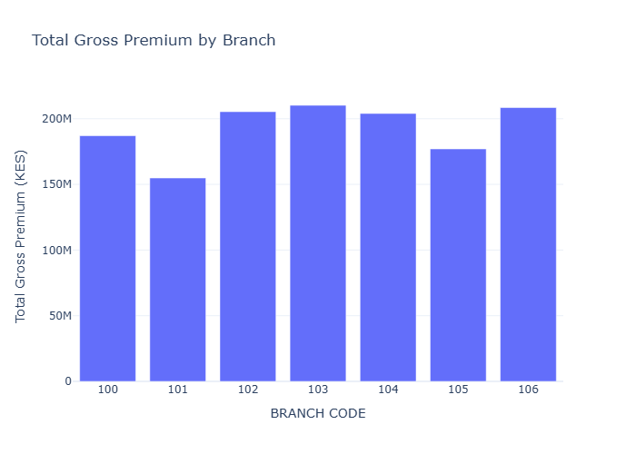
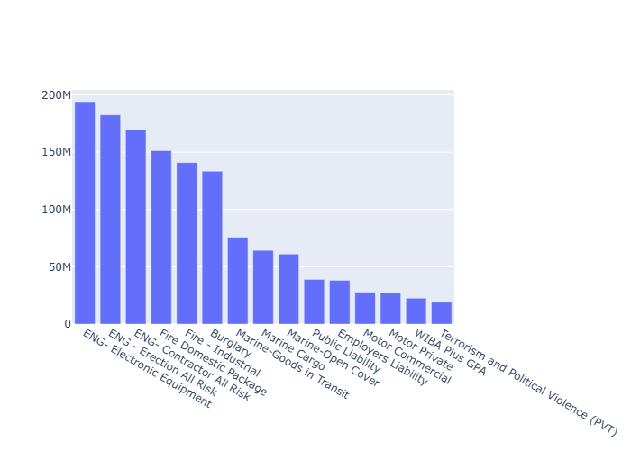
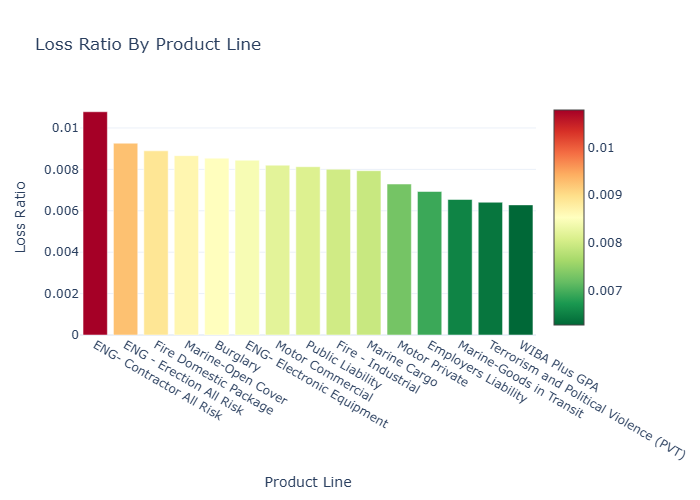
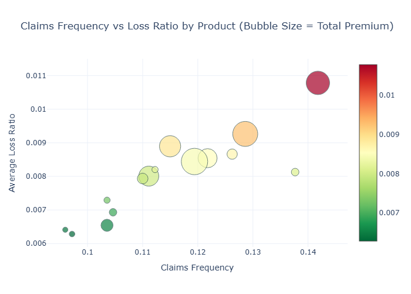
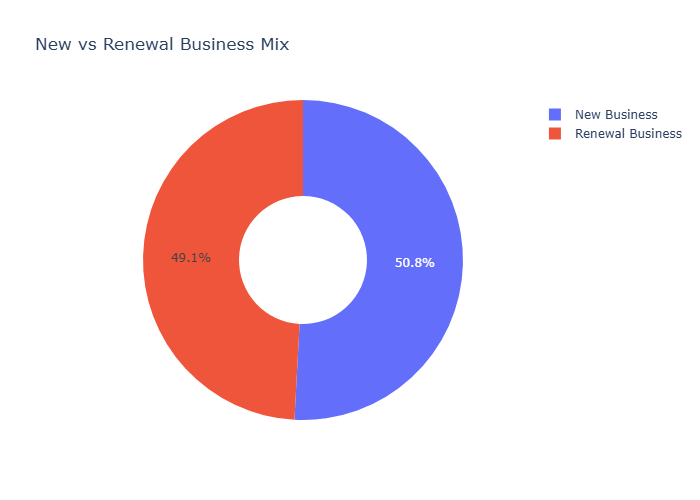
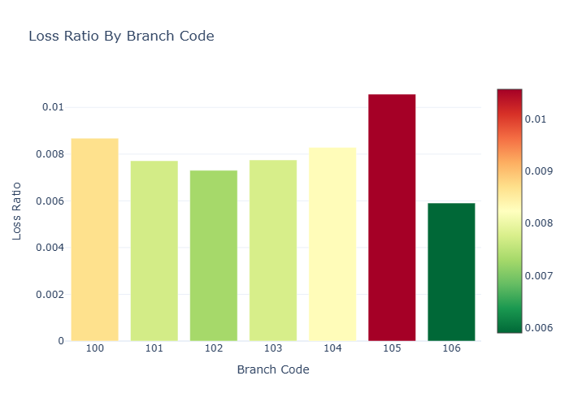

# Premium Bordereaux Analysis

Exploratory analysis of an insurance premium bordereaux dataset, examining
premium volume, claims behavior, and loss ratios across branches, product
lines, and distribution channels.

## Data

The dataset used in this project is fully synthetic, generated to mirror
the structure and realistic value ranges of a real insurance premium
bordereaux report. No real customer or company data is included.

## Total Premium by Branch

Premium is concentrated but not dominated by one branch. Branch 103 leads
in total premium (~KES 210M), roughly 35% higher than the lowest branch
(101, ~KES 155M).

## Total Premium by Product Line

Engineering and fire products (Contractor All Risk, Erection All Risk,
Electronic Equipment, Fire Domestic Package) generate the highest premium
volumes, while liability and motor lines contribute comparatively less.

## Average Loss Ratio by Product Line

Engineering and fire products also carry the highest loss ratios,
consistent with their exposure to large, infrequent losses typical of
these classes.

## Claims Frequency vs. Loss Ratio by Product

Claims frequency and loss ratio move together rather than trading off —
products that are claimed on more often also tend to show higher average
loss ratios. Bubble size reflects total premium for that product, so the
largest, most exposed products are easy to spot.

## New vs. Renewal Business Mix

The book is close to evenly split between new (51%) and renewal (49%)
business. New business runs a slightly higher average loss ratio than
renewals (0.0086 vs 0.0074), plausibly because renewed policies are
already proven, lower-risk business, while new business is unknown risk
in its first year.

## Average Loss Ratio by Branch

Branch 105 stands out with a notably higher loss ratio (~0.0102) compared
to the rest of the network, which clusters between 0.006–0.0087, making
it a candidate for closer underwriting review. Branch 106 shows the
lowest loss ratio (~0.006).

## Tools

Python, pandas, Plotly (`graph_objects`)

## How to Run

1. Clone this repo
2. `pip install pandas plotly kaleido`
3. Open `notebooks/eda.ipynb` in VS Code or Jupyter
4. Run all cells — data is loaded via a relative path from `data/`